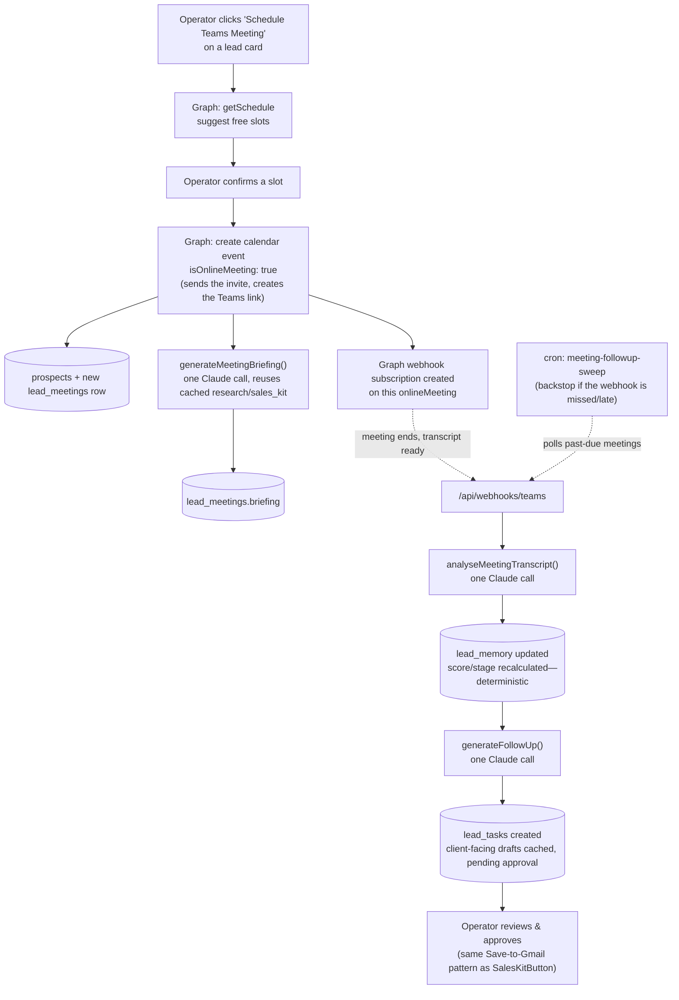

# Microsoft Teams AI Meeting Intelligence: Planning Document

Status: Phase 1 (scheduling only, no AI) is built and typechecks/lints/builds clean — untested against a live Microsoft account, since Phase 0 (Azure AD app registration, confirming the M365 licence covers the transcript API) is still outstanding. Phases 2–5 are still just the plan below. Written the same way `leads-automation-plan.md` was — grounded in the actual current state of `/admin/leads` (research pipeline, sales kit, pipeline widgets all live as of High Impact #6–9) rather than a hypothetical greenfield build.

**Build note (deviation from the plan below):** section 2 originally assumed a fourth env var, `MS_REFRESH_TOKEN`, mirroring `GOOGLE_REFRESH_TOKEN`. That turned out to be wrong once actually building it — Microsoft's v2.0 token endpoint rotates the refresh token on every use (Google's stays static), and nothing at runtime can rewrite a Vercel env var. The refresh token lives in a new `ms_graph_tokens` table instead (`supabase/schema-ms-graph.sql`), rewritten automatically every time `getMsAccessToken()` runs. `/admin/ms-setup` also skips the Google flow's "copy this value into your env vars" manual step entirely as a result — connecting there is now one click, no redeploy needed.

## 0. What this builds on

This repo already has almost every pattern this feature needs — just for Google, not Microsoft. The whole design below is "do the Microsoft equivalent of something that already works," not new invention:

| Need | Existing precedent | New equivalent |
|---|---|---|
| OAuth with a refresh token, no interactive login at runtime | `src/lib/google-auth.ts` (`GOOGLE_CLIENT_ID`/`SECRET`/`REFRESH_TOKEN` env vars, set up once via `scripts/google-oauth-setup.mjs`) | `src/lib/ms-graph-auth.ts`, `MS_CLIENT_ID`/`SECRET`/`TENANT_ID`/`REFRESH_TOKEN`, `scripts/ms-graph-oauth-setup.mjs` |
| Create a calendar event | `src/lib/calendar-sync.ts` | Extended: an event with `isOnlineMeeting: true` creates the Teams meeting and the calendar entry together |
| Draft/send email server-side | `src/lib/gmail-draft.ts` | Reused as-is for follow-up emails — no Microsoft equivalent needed, outreach stays on Gmail |
| Connection-health banner | `src/lib/check-google-connection.ts` + the warning card on `/admin/leads` | `check-ms-connection.ts` + a second banner, same shape |
| One cached Claude call per lead, tool-forced JSON, never regenerated except on click | `src/lib/research-lead.ts`, `src/lib/draft-sales-kit.ts` | Same pattern, applied to meeting prep / meeting analysis / follow-up generation (section 4) |
| Deterministic score instead of an LLM guess | `computeLeadScore()` in `research-lead.ts` | Same principle for sales-stage/urgency/deal-value recalculation (section 4) |
| Generic append-only event log | `audit_log` table + `logAuditEvent()` | Reused as-is, new action strings only |
| Background job on a schedule | `vercel.json` crons (`site-checks`, `weekly-digest`, `self-check`, …) | One new cron, as a backstop not the primary trigger (section 6) |
| External-service webhook, signature-verified, outside admin auth | `src/app/api/webhooks/stripe/route.ts` | `src/app/api/webhooks/teams/route.ts` |
| "Generate once, show it, never auto-send" gate | `EmailLeadButton`/`SalesKitButton`'s Save-to-Gmail flow | Reused directly for meeting follow-up client actions |

---

## 1. Recommended architecture



Two structural points worth being explicit about, because they shape everything below:

- **This stack has no message queue or event bus** (Vercel + Supabase, no Redis/BullMQ/SQS). Every "trigger" in this plan is either (a) a Microsoft Graph webhook (a real push notification, the only genuinely async part of this feature) or (b) a Vercel cron poll, exactly like the five that already exist. Section 6 maps the request's event list onto which of these two things it actually is.
- **"Background AI workflow" here means the same thing it already means in this codebase**: a single Anthropic tool-forced call inside a server action or route handler, well under Vercel's function timeout, caching its result to a jsonb column. Not a separate worker process — `research-lead.ts` and `draft-sales-kit.ts` are already proof this pattern scales fine for this workload.

---

## 2. Microsoft Graph API requirements

- **Azure AD app registration**, single-tenant (Hamish's own M365 tenant). Delegated permissions, not application permissions — same reasoning as the Gmail integration: Hamish is a solo operator, meetings are organized *as* him anyway, and delegated auth avoids tenant-admin-consent overhead that application permissions require.
- **Scopes**: `OnlineMeetings.ReadWrite`, `Calendars.ReadWrite`, `OnlineMeetingTranscript.Read.All`, `OnlineMeetingArtifact.Read.All` (covers recording metadata), `Chat.Read`, `User.Read`, `offline_access` (for the refresh token).
- **Auth flow**: authorization-code grant once, refresh token stored as an env var, refreshed automatically from then on — identical shape to `GOOGLE_REFRESH_TOKEN`. One-time script, `scripts/ms-graph-oauth-setup.mjs`, mirroring the existing Google one.
- **Endpoints needed**:
  - `POST /me/findMeetingTimes` — suggested slots from calendar availability
  - `POST /me/events` with `isOnlineMeeting: true, onlineMeetingProvider: "teamsForBusiness"` — creates the calendar event *and* the Teams meeting *and* sends the invite, in one call
  - `GET /me/onlineMeetings/{id}` — join URL, participant list
  - `GET /me/onlineMeetings/{id}/transcripts` (+ content) — transcript text
  - `GET /me/onlineMeetings/{id}/recordings` — recording *metadata only*; this plan never downloads or stores the video itself, just references it
  - `POST /subscriptions` — webhook registration on the onlineMeeting resource for transcript/recording-ready notifications. Graph subscriptions expire (typically well under a week for these resource types) and must be renewed — this is what the Phase 3 cron is for.
- **Licensing caveat — verify before relying on it**: transcript/recording API access is gated by the tenant's M365 plan in ways that go beyond just turning transcription on in the Teams UI. This needs checking against Hamish's actual subscription before Phase 3 is built in detail; see Risks (section 9) for the fallback if it's not available.

---

## 3. Database changes required

Same convention as every other `schema-*.sql` file: RLS enabled, no public policies, written only via the service-role client from `/admin` routes.

**New columns on `prospects`** (mirrors the `research`/`sales_kit` jsonb-blob pattern):

```sql
alter table prospects add column if not exists lead_memory jsonb;
alter table prospects add column if not exists lead_memory_updated_at timestamptz;
alter table prospects add column if not exists sales_stage text;        -- discovery | meeting_scheduled | proposal_sent | negotiating | won | lost
alter table prospects add column if not exists urgency text;            -- low | medium | high
alter table prospects add column if not exists deal_value_estimate text; -- reuses research's banded convention, not a fabricated exact figure
```

`sales_stage` is deliberately separate from the existing `status` column — `status` drives the outreach cadence (`needs_verification`/`ready`/`contacted`/`not_fit`) that `lead-status.ts` already depends on; overloading it with deal-progression states would break that logic.

**New table `lead_meetings`** — a lead can have more than one meeting over its life (discovery call, proposal review); one row per meeting, not flattened onto `prospects`:

```sql
create table if not exists lead_meetings (
  id uuid primary key default gen_random_uuid(),
  prospect_id uuid not null references prospects(id),
  ms_event_id text,
  ms_meeting_id text,
  scheduled_start timestamptz not null,
  scheduled_end timestamptz not null,
  join_url text,
  status text not null default 'scheduled', -- scheduled | completed | cancelled | no_show
  briefing jsonb,
  briefing_generated_at timestamptz,
  transcript_raw text,       -- fetched once, cached, never re-fetched
  analysis jsonb,
  analysis_generated_at timestamptz,
  created_at timestamptz not null default now()
);
```

**New table `lead_tasks`** — the "Internal Actions" (create proposal task, prepare demo, research competitor). Mirrors the existing `tasks` table shape (`schema-internal-ops.sql`) but scoped to prospects, which `tasks` isn't:

```sql
create table if not exists lead_tasks (
  id uuid primary key default gen_random_uuid(),
  prospect_id uuid not null references prospects(id),
  meeting_id uuid references lead_meetings(id),
  title text not null,
  description text,
  status text not null default 'todo',
  created_at timestamptz not null default now()
);
```

**New table `ms_graph_subscriptions`** — webhook bookkeeping, since subscriptions expire and need renewing:

```sql
create table if not exists ms_graph_subscriptions (
  id text primary key, -- Graph's own subscription id
  resource text not null,
  expires_at timestamptz not null,
  renewed_at timestamptz
);
```

`audit_log` needs no schema change (already generic) — new action strings only: `lead.meeting_scheduled`, `lead.meeting_briefing_generated`, `lead.meeting_completed`, `lead.meeting_analysed`, `lead.followup_generated`, `lead.followup_approved`.

---

## 4. AI workflow design

The request's ten-plus bullet-pointed sections map onto **three Claude calls total per meeting lifecycle** — one at scheduling, one after the meeting, one after analysis — by grouping structurally-similar outputs into single tool-forced calls, exactly the way `draft-sales-kit.ts` collapsed six drafting tasks into one:

1. **`generateMeetingBriefing(prospectId, meetingId)`** — triggered synchronously right after the meeting is created (no separate async step needed, it's one more call in the same request). Produces Client Overview + Opportunity Analysis + Meeting Assistant *together*, one tool schema, three sections of the response. Reads cached `research`/`sales_kit` as input instead of re-deriving business analysis from scratch — only calls `researchLead()` first if research is missing or the website changed, otherwise this costs one call, not four.
2. **`analyseMeetingTranscript(meetingId)`** — triggered by the webhook (or the cron backstop). Fed the transcript (or, if unavailable, chat messages + duration + participants as a lower-fidelity fallback) plus the current `lead_memory` as context. Produces the entire "AI Meeting Summary" section *and* the `lead_memory` delta (updated pain points, requirements, buying signals, next actions, key contacts) in one response — the request's "AI Meeting Summary" and "Automatically Update Lead Intelligence" sections are two read of the same transcript, so they're one call, not two.
3. **`generateFollowUp(meetingId)`** — triggered right after analysis. Produces both Internal Actions (as `lead_tasks` rows) and Client Actions (follow-up email, proposal outline reusing `sales_kit`'s `proposal_outline` shape, summary email, info checklist) in one response.

**Score/probability/deal-value/urgency recalculation is not an AI call** — deterministic, same principle as `computeLeadScore()`: a weighted formula over buying-signal count, objection count, whether a decision-maker was present, meeting held (bool), layered on the existing research score. Fast, free, auditable, consistent — and it means the AI is never asked to invent a number, only to observe facts.

All client-facing text (follow-up email, proposal outline, summary email) sits behind the exact same "generate once, cache it, Copy/Save-to-Gmail button, never auto-send" gate already built for `sales_kit` — this reuses `saveSalesKitEmailToGmail`'s pattern rather than inventing a new send path, satisfying the request's own "require approval before sending" requirement for free.

---

## 5. Token optimisation strategy

Direct answers to the request's own checklist:

- **Can this be stored permanently?** Yes — `lead_memory` jsonb is the permanent store; every workflow *reads* it, none re-derive it from scratch.
- **Can this be calculated without AI?** Score/probability/deal-value/urgency, and `sales_stage` transitions — all deterministic (section 4).
- **Can existing analysis be reused?** Yes — meeting prep reuses cached `research` + `sales_kit` instead of re-analysing the website/business.
- **Can only changed information be processed?** Meeting prep only re-researches if stale; post-meeting analysis processes the new transcript plus the *current* `lead_memory` snapshot, never the full `audit_log`/meeting history.
- **Can multiple outputs come from one call?** Yes throughout — three calls per meeting, not ten-plus.

At roughly three Haiku calls per meeting from scheduling to close, even a high-volume year (a few hundred meetings) stays in the same low-single-digit-dollars-total territory the research pipeline already established — cost scales with meetings held, not with page views or lead volume.

---

## 6. Event-driven architecture, realistically

| Request's trigger | What it actually is in this stack |
|---|---|
| New Lead Created | Already exists (High Impact #6) — no change |
| Meeting Scheduled | Synchronous — one more Anthropic call in the same server action that creates the Graph event |
| Meeting Completed | Genuinely async (a transcript isn't ready the instant a call ends) — a **Graph webhook subscription** hitting a new `/api/webhooks/teams` route (mirrors `/api/webhooks/stripe`'s signature-validation pattern), with a **cron backstop** (`meeting-followup-sweep`, same shape as `site-checks`) polling `lead_meetings` for anything past `scheduled_end` with no `analysis` yet, in case the webhook is missed, the subscription expired, or transcript processing lags |
| Proposal Sent | Extend the existing `lead-status.ts` cadence machinery with a `proposal_sent_at` column, rather than inventing a new trigger type |
| Client Inactive | Extend the existing `isStaleLead()` logic in `page.tsx` — the "re-engagement workflow" it suggests should be an operator-clicked generation (like everything else here), not something that runs unattended, matching this codebase's established never-auto-send principle |

Net new infrastructure: **one webhook route, one cron route**. Nothing else — no queue, no worker process, nothing outside what's already in this repo's toolkit.

---

## 7. UX improvements

- `ScheduleTeamsMeetingButton` — same `useActionState` shape as `SalesKitButton`: click shows suggested slots, confirm creates the meeting, then shows a Join link and a scheduled-date badge next to `ContactBadge`.
- `MeetingBriefingPanel` — expandable panel identical to `ResearchLeadButton`/`SalesKitButton` (Show/Hide), auto-populated with no manual generate click needed (per the request), but the same read-only cached-render pattern otherwise.
- `MeetingSummaryPanel` — same shape, appears once `lead_meetings.analysis` is populated; surfaces buying signals/objections/risks with colour-coded `Badge` variants, matching the existing convention.
- Follow-up drafts render exactly like the sales-kit email section — Copy / Save to Gmail / approve — no new interaction pattern for Hamish to learn.
- A `sales_stage` badge alongside the existing status pills on each lead card.
- A natural sixth "Pipeline:" widget once this ships: "Meeting this week" — same `INSIGHT_PREDICATES` pattern from High Impact #9.
- A Microsoft connection-health banner, twin to the existing Gmail one, from Phase 1 — see Risks.

---

## 8. Implementation roadmap

- **Phase 0 (prerequisite, Hamish-side — not something I can do)**: confirm the M365 plan actually supports Graph transcript/recording API access; register the Azure AD app; run the one-time OAuth setup script to mint `MS_REFRESH_TOKEN`. Nothing in Phase 1+ can start without this, the same way Gmail drafting couldn't work before `scripts/google-oauth-setup.mjs` was run once.
- **Phase 1 — Scheduling only, no AI.** ~~Ships something usable in one session, same as how High Impact #6 shipped before #7–9 layered on.~~ **Built** (`ms-graph-auth.ts`, `check-ms-connection.ts`, `teams-meeting.ts`, `ScheduleTeamsMeetingButton`, `lead_meetings` + `ms_graph_tokens` tables, `/admin/ms-setup`, `/api/internal/ms-callback`, audit-log entries, connection-health banner on `/admin/leads`). `findAvailableSlots()` deliberately skips Graph's `findMeetingTimes` — see the comment at the top of `teams-meeting.ts` for why — and instead reads Hamish's own `calendarView` directly, offering business-hour slots over the next week. Not yet exercised against a live Microsoft account (blocked on Phase 0).
- **Phase 2 — Meeting prep AI.** `generateMeetingBriefing`, `MeetingBriefingPanel`, triggered automatically right after Phase 1's create-meeting action succeeds.
- **Phase 3 — Post-meeting webhook + analysis.** `/api/webhooks/teams`, `analyseMeetingTranscript`, `lead_memory`, deterministic score/stage recalculation, `meeting-followup-sweep` cron backstop.
- **Phase 4 — Follow-up automation.** `generateFollowUp`, `lead_tasks`, approval-gated client-action drafts reusing the sales-kit Save-to-Gmail pattern.
- **Phase 5 — Pipeline + re-engagement.** "Meeting this week" widget, Client Inactive re-engagement generation.

Each phase is independently shippable and gets its own commit, same cadence as #6 → #7 → #8 → #9.

---

## 9. Risks and limitations

- **Transcript/recording licensing isn't fully visible until tried.** Verify against Hamish's actual M365 subscription before Phase 3 is scoped in detail. If unavailable, Phase 3 degrades gracefully to chat-messages + duration + participants only — still useful, much lower fidelity than a transcript.
- **Recording/transcribing a prospect call carries UK GDPR/PECR notice obligations.** The invite and/or a verbal note needs to disclose the call may be recorded/transcribed — a process change for Hamish, not something code alone covers; worth a line in the meeting-invite template from Phase 1.
- **Delegated auth means every meeting is created "as Hamish" personally.** Fine for a solo operator, but a stale/revoked token breaks meeting creation silently until noticed — the same class of risk the [[hamishai-dns-incident-2026-08]] and Gmail-connector incidents already in memory show this stack is prone to. The connection-health banner in Phase 1 is the mitigation, not optional polish.
- **Graph webhook subscriptions expire and transcript-ready timing isn't instant or guaranteed.** The Phase 3 cron backstop is the actual reliability mechanism; the webhook is the fast path, not the only path.
- **AI-extracted "buying signals"/"budget indicators" are inference, not fact.** Must render as clearly AI-inferred in the UI, matching the "internal prioritisation only, never state to the prospect" framing `research-lead.ts`'s prompt already uses.
- **Two OAuth providers now hold live tokens for this app.** Doubles the "silent auth breakage" surface — worth a combined connection-status view eventually rather than two separate banners forever.

---

## 10. Example user journey

Lead created → researched (#6) → sales kit generated (#8) → operator clicks **Schedule Teams Meeting**, confirms a slot → Graph creates the event, sends the invite, meeting briefing auto-generates in the background → meeting happens → Graph webhook fires once the transcript is ready → `analyseMeetingTranscript` runs → `lead_memory` updates, score/stage/urgency recalculate deterministically, sales_stage moves to `proposal_sent`-pending → follow-up drafts (email + proposal outline) generate, sitting for review → Hamish reviews, approves, sends → the existing cadence machinery tracks the reply → signed.

---

## Recommended build order

Phase 0 (blocked on Hamish: Azure app registration + licence check) → Phase 1 → 2 → 3 → 4 → 5, same incremental, individually-committed cadence as the rest of `leads-automation-plan.md`.
